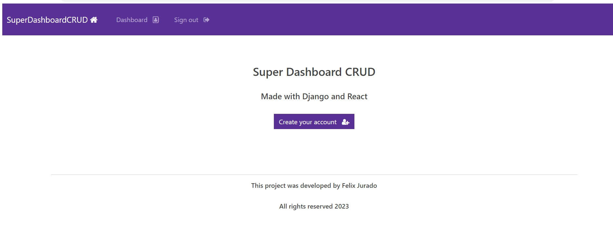
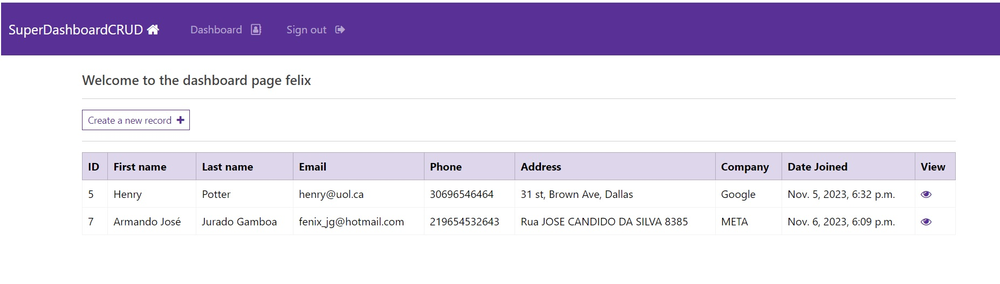

<h1 align="center"> SUPER DASHBOARD CRUD </h1>

This dashboard has been made to solve an Internship challenge at BIX Tech Florianopolis.

  <a href="#-tecnologias">Technologies</a>&nbsp;&nbsp;&nbsp;|&nbsp;&nbsp;&nbsp;
  <a href="#-projeto">Project</a>&nbsp;&nbsp;&nbsp;|&nbsp;&nbsp;&nbsp;
  <a href="#-layout">Layout</a>&nbsp;&nbsp;&nbsp;|&nbsp;&nbsp;&nbsp;
  

  

 

  

## 💻 Technologies

- asgiref==3.6.0
- Django==4.2
- django-crispy-forms==1.14.0
- sqlparse==0.4.4
- tzdata==2023.3

## 🚀 Technologies

Esse projeto foi desenvolvido com as seguintes tecnologias:

- HTML & CSS
- JavaScript/React
- Git & Github
- Python/Django

## 🚀 Extra resources

- Bootswatch
- Bootstrap
- Bootstrap Icons
- Django Crispy Forms
- Font Awesome
- Get Emoji

## 💻 Project

This repository contains the source code for a dashboard application built with Django and React, implementing basic CRUD (Create, Read, Update, Delete) functionality.

## 🔖 Layout

You can actually watch a video of me explaining the features of the program at this link: https://www.loom.com/share/d91455d51a834b66b5569d22d7cfa76e?sid=b695d2ea-9c3d-429a-bf17-a67de2be3042

---

Made by Felix Jurado 2023 , check out my LinkedIN https://www.linkedin.com/in/felix-jurado-mba-2271a366/